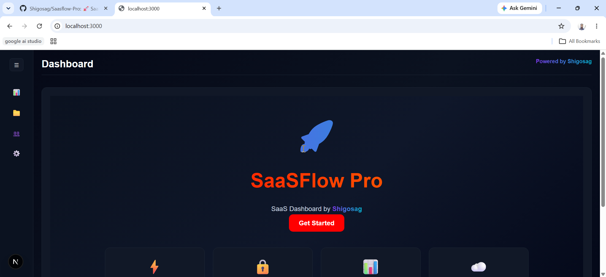
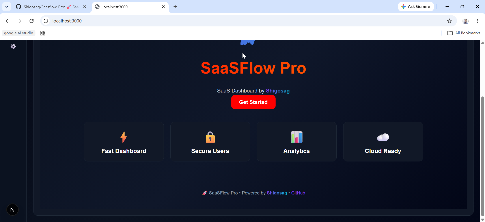
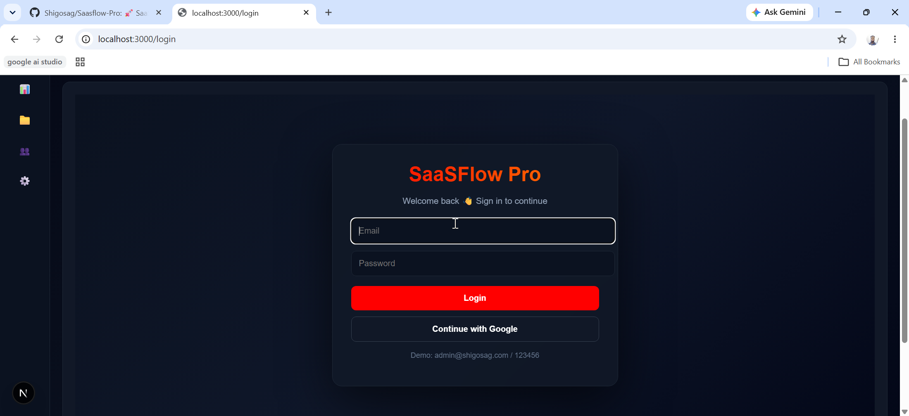

# 🚀 SaaSFlow Pro

[](https://www.typescriptlang.org/)
[](https://nodejs.org/)  
[](https://neon.tech/)
[](LICENSE)

Modern SaaS Dashboard built with **Next.js**, **NextAuth**, and **Neon PostgreSQL**.

Designed and developed by **Shigosag**.

## 🖼️ Dashboard Overview

| Top Section | Bottom Section |
| :---: | :---: |
|  |  |

---

## 🎥 SaaSFlow Pro Demo & Walkthrough

<div align="center">
  <video src="https://github.com/user-attachments/assets/e41cddb9-13ea-4d10-950a-16759f9f21a5" width="100%" controls></video>
</div>

**Timestamps:**
- **0:00** - Dashboard Overview
- **0:25** - Authentication / Login flow
- **0:40** - Sidebar Overview
- **1:16** - Github Repository Overview

---

## ✨ Features

- 🔐 Authentication (NextAuth Credentials + Google)
- 📊 Modern SaaS Dashboard UI
- 👥 User Role System (Admin/User)
- ⚡ Fast Next.js App Router
- ☁️ Neon PostgreSQL Database
- 🎨 Clean responsive UI design

---

## 🧰 Tech Stack

- Next.js 15
- React
- NextAuth.js
- Prisma ORM
- Neon PostgreSQL
- TypeScript
- CSS Modules / Inline Styling

---

## 🗄️ Database (Neon PostgreSQL)

This project uses **Neon Serverless PostgreSQL**.

👉 Neon Docs: https://neon.tech

Add your connection string in `apps/api/.env`:

DATABASE_URL="your_neon_postgres_connection_string" 

---

## Project Structure

```txt
Saasflow-Pro/
│
├── apps/
│   ├── web/
│   └── api/
│
├── packages/
│   ├── ui/
│   ├── types/
│   └── config/
│
├── docker/
│
├── .env
├── docker-compose.yml
├── pnpm-workspace.yaml
└── README.md
```

---

## 🖼️ Feature Screenshots

| DashboardTop | DashboardBottom |
| :---: | :---: |
|  |  |

| Login Flow |
| :---: |
|  |

---

## 🚀 Setup Instructions

## Prerequisites
- Node.js (v18+)

## 1. Clone repository

```bash
git clone https://github.com/shigosag/Saasflow-Pro.git
cd Saasflow-Pro
```

### Start Backend 
```bash
cd apps/api
pnpm install
pnpm prisma generate
pnpm prisma migrate dev
pnpm dev
```

App: http://localhost:5000

### Start Frontend
```bash
cd apps/web
pnpm dev
```

App: http://localhost:3000

---

## 👨‍💻 Author & Credits

- Built by **Shigosag**
- Portions of code generated with AI support

GitHub: [Shigosag](https://github.com/shigosag)

---

## 📜 License

MIT License
